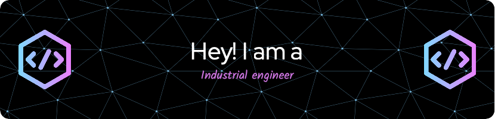

### Hi there 👋
I am a student of mechatronic engineering at the Polytechnic of Turin. I work on algorithms and controls within several projects

## 🌐 Socials:
  

# 💻 Tech Stack:
       
# 📊 GitHub Stats:
 
 

### 🔝 Top Contributed Repo

---

